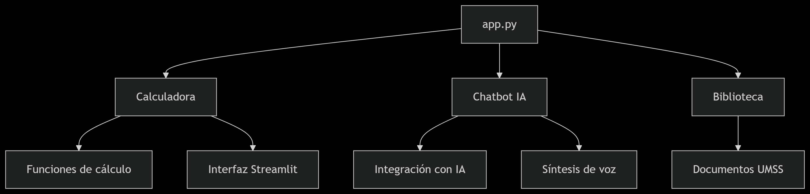

# chat_de_voz_seguridad
📊 Proyecto de Seguridad Industrial - Calculadora de Índices y Asistente Virtual
Este proyecto es una herramienta integral para el cálculo y análisis de indicadores de seguridad industrial, junto con un asistente virtual especializado en normativas de seguridad. Está desarrollado con Python y Streamlit para una interfaz web interactiva.

🧰 Componentes principales
1. Calculadora de Índices de Seguridad
Módulo especializado para calcular los principales indicadores de seguridad industrial:

Índice de Frecuencia (IF): Mide la tasa de accidentes en relación a las horas trabajadas

Índice de Gravedad (IG): Evalúa la severidad de los accidentes

Índice de Incidencia (Ii): Relaciona accidentes con el número de trabajadores

Características:
Arquitectura modular
Este proyecto es una solución completa para la gestión de seguridad industrial que combina:

🧮 Calculadora avanzada de índices de seguridad

🤖 Asistente virtual con capacidades de voz

📚 Biblioteca de documentos técnicos

Módulos implementados
Interfaz principal (app.py)

Sistema de navegación con sidebar

Diseño responsive para móviles y desktop

Gestión de estado con session_state

Configuración centralizada de la página

Submódulos especializados

Calculadora de índices de seguridad

Asistente virtual con capacidades de voz

Biblioteca de documentos técnicos
Interfaz intuitiva con controles para todos los parámetros necesarios

Cálculo automático de horas realmente trabajadas

Dos métodos para calcular jornadas perdidas (por tipo de lesión o valor directo)

Interpretación automática de resultados según estándares internacionales

Visualización clara de fórmulas utilizadas

2. Asistente Virtual de Seguridad Industrial
Chatbot con capacidades de voz para consultas sobre normativas y seguridad:

Funcionalidades:

Reconocimiento de voz para preguntas

Respuestas con síntesis de voz

Especializado en normas bolivianas e internacionales

Capacidad para interpretar resultados de índices de seguridad

Proporciona recomendaciones basadas en los índices calculados

Conocimiento especializado:

Normas NB, ISO, OSHA

Cálculo e interpretación de índices

Ejemplos prácticos y ejercicios resueltos

Protocolos de seguridad industrial

3. Biblioteca de Documentos
Repositorio organizado con materiales de referencia:

Acceso directo a documentos en Google Drive

Tarjetas organizadas por categorías

Visualización optimizada para dispositivos móviles

Desarrollado con Python y Streamlit, ofrece una interfaz web profesional con:

Diseño responsive adaptable a móviles

Integración con APIs de IA (OpenRouter)

Síntesis de voz para respuestas

Gestión documental en la nube (Google Drive)

🛠️ Estructura del código
src/
├── app.py                          # Punto de entrada principal
├── calculadora_indices/
│   ├── calculadora_funciones.py    # Lógica de cálculo de índices
│   └── calculadora_interfaz.py    # Interfaz Streamlit de la calculadora
├── chat_bot/
│   ├── chatbot_ui_interfaz.py     # Interfaz del chatbot
│   ├── ia.py                      # Integración con IA (OpenRouter API)
│   └── voz.py                     # Funciones de síntesis de voz
└── documentos/
|    └── documentos_interfaz.py     # Interfaz de la biblioteca de documentos
└── img/
    └── iconoumss.png     
💡 Cómo usar este proyecto como ejemplo
Estructura modular: Organiza tu código en módulos separados por funcionalidad

Documentación clara: Cada función tiene su docstring explicando su propósito

Interfaz profesional: Usa componentes de Streamlit con estilos CSS personalizados

Ejemplos prácticos: Incluye casos de uso reales en la documentación del chatbot

Buenas prácticas:

Manejo de variables de entorno para claves API

Gestión de estado con session_state

Componentes reutilizables

🚀 Cómo ejecutar el proyecto
Instalar dependencias:

bash
pip install streamlit gtts python-dotenv requests streamlit-mic-recorder
Configurar variables de entorno (.env):

OPENROUTER_API_KEY=tu_clave
OPENROUTER_API_MODEL=modelo_a_usar
OPENROUTER_API_URL=url_del_api
Ejecutar la aplicación:

bash
streamlit run app_principal.py
📌 Notas para futuros proyectos
Este proyecto muestra cómo integrar múltiples funcionalidades en una sola aplicación

Ejemplifica el uso de APIs externas (OpenRouter para IA)

Demuestra técnicas avanzadas de Streamlit (CSS personalizado, gestión de estado)

Proporciona un modelo para documentación técnica clara

Incluye ejemplos de cálculos complejos con interpretación de resultados

Este README sirve como plantilla para documentar proyectos técnicos, destacando:

Propósito del proyecto

Componentes principales

Estructura del código

Instrucciones de instalación

Lecciones aprendidas y buenas prácticas

Cómo Ejecutar el Proyecto
1. Pre-requisitos:
bash
Python 3.8+
pip install -r requirements.txt
Configuración:
Crear archivo .env con:
2. Configuración:
env
OPENROUTER_API_KEY=tu_clave_api
OPENROUTER_API_MODEL=modelo_elegido
OPENROUTER_API_URL=https://api.openrouter.ai/v1/chat/completions
Ejecución:

3. Ejecución:
bash
streamlit run app.py
